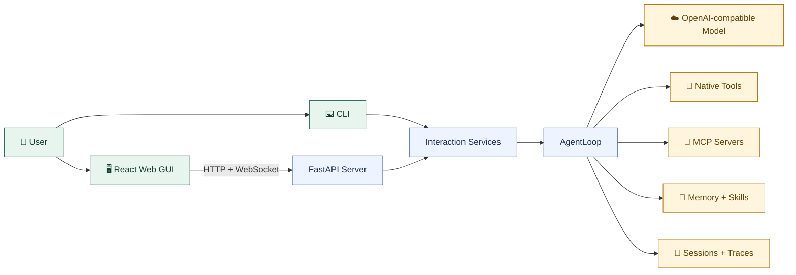
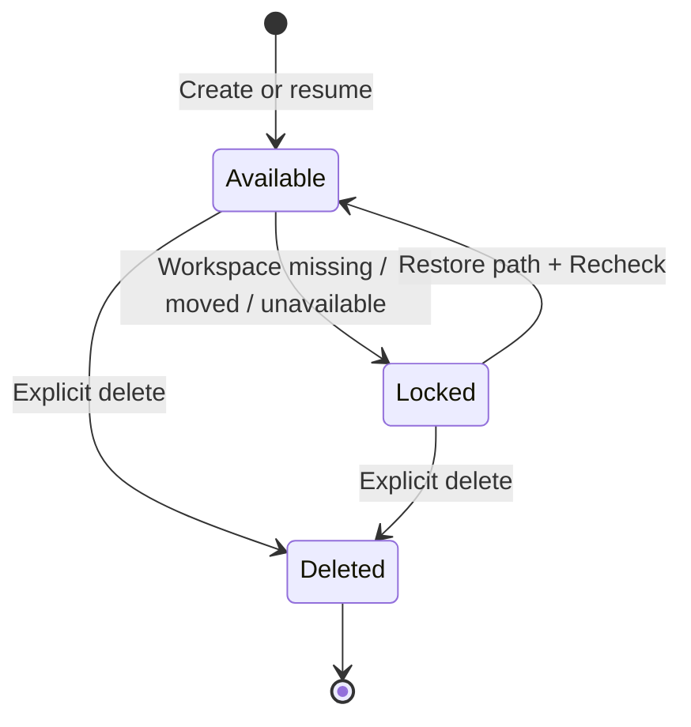

<div align="center">


# 🌿 lulu-agent

**一个在本地运行、理解你的工作区，并能持续积累记忆与技能的通用 AI Agent。**

让水豚噜噜陪你聊天、读写文件、执行命令、调用工具，把每一次协作沉淀成下一次更顺手的体验。

[](https://github.com/kukojoy/lulu-agent)
[](https://github.com/kukojoy/lulu-agent/stargazers)

[快速开始](#quick-start) · [核心能力](#features) · [工作原理](#architecture) · [配置指南](#configuration) · [交互方式](#interaction) · [本地数据](#local-data)

`Agent Harness` · `Local Runtime` · `Self-evolving`

</div>

> 🌱 **认识水豚噜噜**
>
> 水豚噜噜是你的 lulu-agent 工作伙伴。它安静、可靠，喜欢待在你的本地工作区旁边，也代表这个项目的设计取向：不过度打扰，把工作留在本地，在一次次真实任务中逐渐熟悉你的习惯。

## ✨ lulu-agent 是什么

`lulu-agent` 是一个本地通用 agent runtime harness，同时提供 Web GUI（推荐）和 CLI。它不是只会回答问题的聊天窗口，而是可以围绕一个真实 workspace 读取项目上下文、操作文件、运行命令、调用外部工具，并将 session、trace、memory 和 skills 持久化到本地。

当前版本：`v4.0`。

它适合以下场景：

- 🗂️ **项目协作**：围绕指定 workspace 阅读文件、检索内容、修改代码或文档。
- 🧰 **本地自动化**：执行 Shell 命令，通过原生工具或 MCP 扩展工作流。
- 🧠 **长期协作**：保存跨会话事实与偏好，复用已经形成的 Skills。
- 🔍 **过程诊断**：通过 Trace 查看模型请求、重试、工具调用和 turn 结束状态。
- 🧩 **模型自由**：连接支持 Chat Completions 与 tool calling 的 OpenAI-compatible 服务。

<a id="features"></a>

## 📋 核心能力

| 能力 | 你可以做什么 |
| :--- | :--- |
| 🖥️ **Web GUI** | 按 workspace 管理 session，完成聊天、工具调用、任务状态、Trace、Memory、Skills 和 MCP 查看。 |
| ⌨️ **CLI 辅助入口** | 在纯终端环境中恢复会话，或检查 session 与最终模型 context。 |
| 🧭 **Session workspace** | 每个 session 固定绑定自己的 workspace，文件、搜索、Shell 和项目指导都在该边界内运行。 |
| 💾 **持久化** | session、任务状态和 trace 保存在全局 `~/.lulu/`，可跨 workspace 恢复。 |
| 📁 **本地文件工具** | 列文件、读文件、写文件、替换内容和全文搜索。 |
| 🐚 **Shell 与安全确认** | 执行本地命令，对高风险操作进行拦截或请求用户确认。 |
| 🌐 **Web 工具** | 通过 Tavily 搜索网页并提取内容。 |
| 🧠 **Memory** | 保存跨 session 的长期事实、偏好和经验。 |
| 🧩 **Skills** | 将可复用流程沉淀为全局 skill，并在需要时读取。 |
| 🔌 **MCP** | 从全局配置加载外部 stdio MCP 工具，并在 GUI 中查看或重新加载。 |
| 🔬 **Trace** | 按 turn 查看模型请求、retry、工具调用、工具结果和 knowledge review。 |
| 🌱 **Knowledge review** | 后台定期审查 memory / skills，在 Trace 中显示 review 状态和粗粒度变更摘要。 |

<a id="quick-start"></a>

## 🚀 快速开始

### 1. 准备环境

请先安装以下运行环境：

- Python 与 `pip`（推荐使用 conda 或 uv 管理环境）
- Node.js 与 `npm`（用于 Web GUI）

> 🪟 **Windows 用户建议使用 WSL2**
>
> 原生 Windows 可以通过 `lulu.bat` 启动，但部分依赖、Shell 和工具调用场景的兼容性仍不完善。为了获得更稳定、接近 Linux/macOS 的完整体验，推荐在 WSL2 中安装并运行 lulu-agent。

克隆仓库并进入项目目录：

```bash
git clone https://github.com/kukojoy/lulu-agent.git
cd lulu-agent
```

### 2. 安装依赖

安装 Python 依赖：

```bash
python -m pip install -r requirements.txt
```

安装 GUI 依赖：

```bash
cd gui
npm install
cd ..
```

### 3. 初始化 lulu

```bash
python setup/lulu_setup.py
```

首次使用前建议运行这一步。它会准备 `~/.lulu/` 中的 `memory/MEMORY.md`、`skills/`、`mcp.json` 和 `models.json`；session 与 trace 目录会在首次写入时自动创建。已有同名配置或 skill 不会被覆盖。

### 4. 配置模型

打开 `~/.lulu/models.json`，填写一个支持 OpenAI-compatible Chat Completions 与 tool calling 的模型服务：

```json
{
  "default_provider": "deepseek",
  "providers": {
    "deepseek": {
      "base_url": "https://api.deepseek.com",
      "api_key": "your-api-key",
      "default_model": "deepseek-v4-flash"
    }
  }
}
```

暂不使用的 provider 可以保留空的 `base_url` 或 `api_key`。它仍会显示在 GUI 中，但无法选择。

### 5. 启动 Web GUI

macOS / Linux：

```bash
./lulu.sh
```

原生 Windows（兼容性有限）：

```bat
.\lulu.bat
```

启动脚本会同时启动后端与 GUI，等待两端 ready 后打开浏览器。默认起始地址为：

| 服务 | 默认地址 |
| :--- | :--- |
| Backend | `http://127.0.0.1:8000` |
| Web GUI | `http://127.0.0.1:5173` |

如果端口已经被占用，脚本会自动尝试后续端口。按 `Ctrl+C` 会停止前后端进程。

> 💡 **Workspace 提示**
>
> 启动脚本所在 Shell 的当前目录会成为新 session 的默认 workspace。你也可以在 GUI 创建 session 前浏览并选择其他目录。

<a id="architecture"></a>

## 🗺️ 工作原理

### 运行架构



GUI 只通过本地 HTTP / WebSocket 与后端交互。AgentLoop 负责一次 turn 的模型与工具链路，session、trace、memory 和 skills 则作为不同用途的持久化层保存在本机。

### Session 与 workspace 生命周期



每个 session 会记住创建时选择的 workspace。路径失效后 session 会被锁定，避免后续操作意外落到其他目录；恢复原路径并点击 `Recheck` 后即可继续使用。锁定不会自动删除 session 或 trace。

<a id="configuration"></a>

## ⚙️ 配置指南

### 模型配置

模型配置位于：

```text
~/.lulu/models.json
```

GUI 会尝试从 provider 拉取可用模型列表。`default_model` 留空时可从发现结果中选择；已配置的默认模型不可用时，也可以在 GUI 中手动切换。

### 环境变量

`.env` 用于模型以外的运行配置。当前支持的常用变量包括：

| 变量 | 用途 |
| :--- | :--- |
| `TAVILY_API_KEY` | 启用 `web_search` / `web_extract`。 |
| `MODEL_TIMEOUT_SECONDS` | 设置模型请求超时时间。 |
| `MODEL_MAX_RETRIES` | 设置模型请求失败后的重试次数。 |
| `SAFETY_PROFILE` | 设置本地工具的安全档位。 |

如需使用 Web 工具，可从 Tavily 申请 API key 后配置：

```bash
TAVILY_API_KEY=your-api-key
```

### MCP 配置

MCP 配置位于：

```text
~/.lulu/mcp.json
```

以高德地图 MCP server 为例：

```json
{
  "mcpServers": {
    "amap-maps": {
      "command": "npx",
      "args": ["-y", "@amap/amap-maps-mcp-server"],
      "env": {
        "AMAP_MAPS_API_KEY": "your-amap-api-key"
      },
      "timeout": 30,
      "enabled": true
    }
  }
}
```

请将 `your-amap-api-key` 替换为你自己的高德地图 API key。

启动 session 时，lulu-agent 会连接配置中的 MCP server 并加载工具。可以在 GUI 的 MCP 面板查看加载结果；修改配置或连接异常时，可以针对当前 session 重新加载。

<a id="interaction"></a>

## 🖥️ 交互方式

### Web GUI（强烈推荐）

Web GUI 是 lulu-agent 的主要交互入口，也是功能最完整、最适合日常使用的方式。它提供 workspace 分组的 session 管理、流式对话、工具调用展示、approval、模型切换，以及 Task、Trace、Memory、Skills 和 MCP 等可视化面板。

```bash
./lulu.sh
```

Windows 使用：

```bat
.\lulu.bat
```

原生 Windows 在部分依赖、Shell 和工具调用场景下仍可能存在兼容性问题。Windows 用户更推荐使用 WSL2，并在 WSL 中运行 `./lulu.sh`。

除非当前环境无法运行浏览器或 Node.js，否则建议始终从 Web GUI 开始。

### CLI（辅助与诊断）

CLI 会继续保留，但主要用于纯终端环境、兼容已有工作流、恢复指定 session，以及检查会话和模型 context。它不是推荐的日常主入口，也不提供 GUI 中完整的运行状态与诊断视图。

| 操作 | 命令 |
| :--- | :--- |
| 启动交互会话 | `python -m cli.main` |
| 恢复会话 | `python -m cli.main --resume <session_id>` |
| 列出近期会话 | `python -m cli.main --list-sessions` |
| 查看会话信息 | `python -m cli.main --inspect-session <session_id>` |
| 查看最终 system/context | `python -m cli.main --inspect-context <session_id>` |

交互会话中可以使用以下命令退出：

```text
/exit
/quit
```

<a id="local-data"></a>

## 💾 本地数据

运行数据统一保存在用户目录 `~/.lulu/`：

```text
~/.lulu/
├── sessions/
├── traces/
├── memory/
│   └── MEMORY.md
├── skills/
│   └── <name>/SKILL.md
├── models.json
└── mcp.json
```

| 数据 | 作用 | 生命周期 |
| :--- | :--- | :--- |
| `sessions/` | 保存会话历史和任务状态。 | 显式删除 session 时删除。 |
| `traces/` | 保存按 turn 记录的运行过程。 | 删除 session 时同步删除对应 trace。 |
| `memory/MEMORY.md` | 保存跨 session 的长期事实与偏好。 | 由用户或 agent 维护。 |
| `skills/` | 保存可复用流程及其支持文件。 | 由用户或 agent 维护。 |
| `models.json` | 保存模型 provider 配置。 | 全局配置。 |
| `mcp.json` | 保存 stdio MCP server 配置。 | 全局配置。 |

## 🧠 Memory

Memory 用来保存跨会话的长期事实、偏好和经验，默认路径为：

```text
~/.lulu/memory/MEMORY.md
```

- 你可以直接告诉 agent 需要记住、更新或忘记某条长期信息。
- Memory 会在后续对话中作为上下文提供给模型。
- Memory 不等于聊天记录，不适合保存临时任务状态或完整对话。
- 后台 memory review 会周期性检查最近对话与现有 memory，结果写入 Trace，不进入聊天记录。

## 🧩 Skills

Skill 用来保存可复用的操作流程或工作方法，默认路径为：

```text
~/.lulu/skills/<name>/SKILL.md
```

- agent 可以按需查看已有 skill。
- 你可以要求 agent 创建或修改某个 skill。
- `python setup/lulu_setup.py` 会将内置 skill 安装到全局 skills 目录，已有同名 skill 不会被覆盖。
- 后台 skill review 会周期性检查最近对话是否沉淀出可复用流程，结果写入 Trace，不进入聊天记录。

<a id="mcp"></a>

## 🔌 MCP

MCP 用来接入外部工具。当前支持 stdio MCP server，配置路径为 `~/.lulu/mcp.json`。GUI 的 MCP 面板可以查看当前 session 已加载的 server 和工具，也可以在配置调整后手动 reload。

## 🔬 Trace

GUI 的 Trace 面板按 turn 展示运行过程，包括：

- 模型请求与 retry
- 工具调用与工具结果
- turn 结束状态和错误类型
- 后台 knowledge review 的 `review_summary`

发生过 review 的 turn 会显示 `reviewed`、`review updated` 或 `review failed` 标识。Trace 用于诊断运行过程，不会进入聊天记录或模型上下文。

## 🛡️ 安全与边界

> lulu-agent 当前按本地单用户工具设计，不适合直接作为多用户或公网服务部署。

- 当前安全边界是本地 soft workspace safety，不是完整 OS sandbox。
- Shell 工具会拒绝明显高风险命令，并对部分文件变更命令请求确认。
- Web search / extract 需要 `TAVILY_API_KEY`。
- 当前 MCP 仅支持 stdio transport。
- workspace 失效时 session 会锁定，但数据不会被自动删除或迁移。

## 🤝 参与项目

- ⭐ 如果 lulu-agent 对你有帮助，欢迎为仓库点一个 Star。
- 🐛 遇到问题时，请通过 [GitHub Issues](https://github.com/kukojoy/lulu-agent/issues) 提交可复现步骤、运行环境与相关日志。
- 💡 功能建议请优先说明真实使用场景、预期交互和为什么现有能力无法满足。

<div align="center">

**🌿 和水豚噜噜一起，把本地 AI Agent 变成真正耐用的工作伙伴。**

</div>
